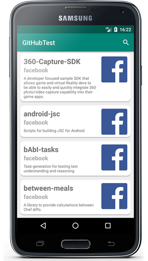
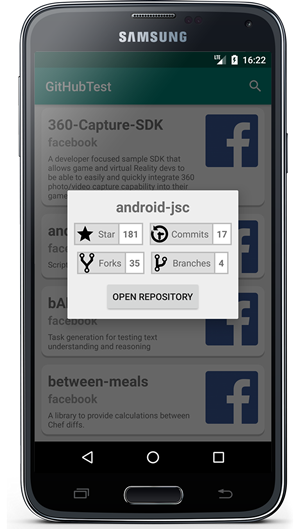

# GitHub Test for Android #
---

 

---
## :wrench: Requisites ##

* Android Studio 3.0+ :computer:
* Android Emulator and/or real Android device :iphone:

---
## :warning: Android compatibility ##

* API 17+: Android 4.2 Jelly Bean

---
## :checkered_flag: Getting Started ##

This repository contains:

1. Application to retrieve the list of public repositories of a GitHub user (for example: Facebook) and display them.

2. Retrieve the information about the specific GitHub Repository, which should contain at least the following:

* Count of the stars
* Count of the commits
* The number of forks
* Count of the branches

3. Display the information described above for each of the repositories.

---
## :camera: Screenshots ##

---
## :books: 3rd party libraries ##

firebase-core
----
Version: 16.0.4

Firebase gives you the tools to develop high-quality apps, grow your user base, and earn more money. We cover the essentials so you can monetize your business and focus on your users.

https://firebase.google.com/support/release-notes/android

crashlytics
-----------
Version: 2.9.6

Firebase Crashlytics is a lightweight, realtime crash reporter that helps you track, prioritize, and fix stability issues that erode your app quality. Crashlytics saves you troubleshooting time by intelligently grouping crashes and highlighting the circumstances that lead up to them.

https://firebase.google.com/docs/crashlytics/

okhttp
----
Version: 3.10.0

An HTTP and SPDY client for Android and Java applications

https://github.com/square/okhttp

gson
----
Version: 2.8.2

A Java serialization/deserialization library to convert Java Objects into JSON and back

https://github.com/google/gson

glide
----
Version: 4.7.1

An image loading and caching library for Android focused on smooth scrolling

https://github.com/bumptech/glide

---
## :clock2: Future developments ##

* Add login screen - login with GitHub account
* Include Unit Tests to achieve a minimum of 70% Condition Coverage and 70% Line Coverage

---
## :pencil: Credits ##

> *Author: [Stefano Russello](http://www.stefanorussello.it/)*
>
> *Date first version: 19/11/2018*